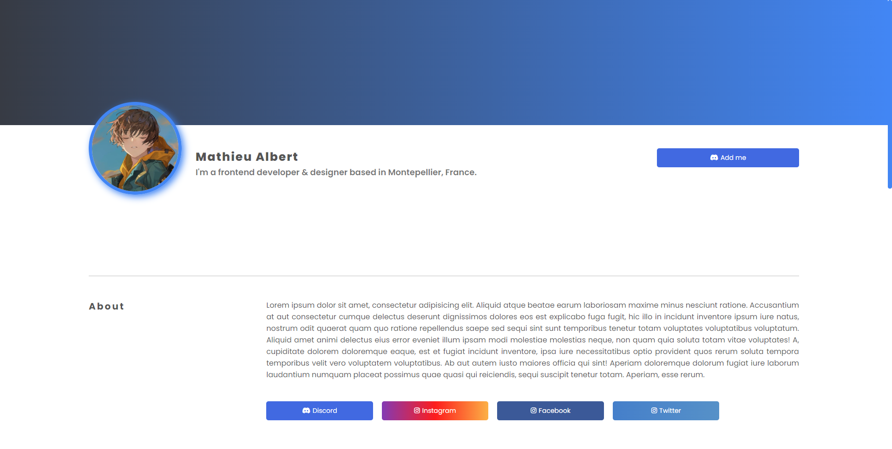
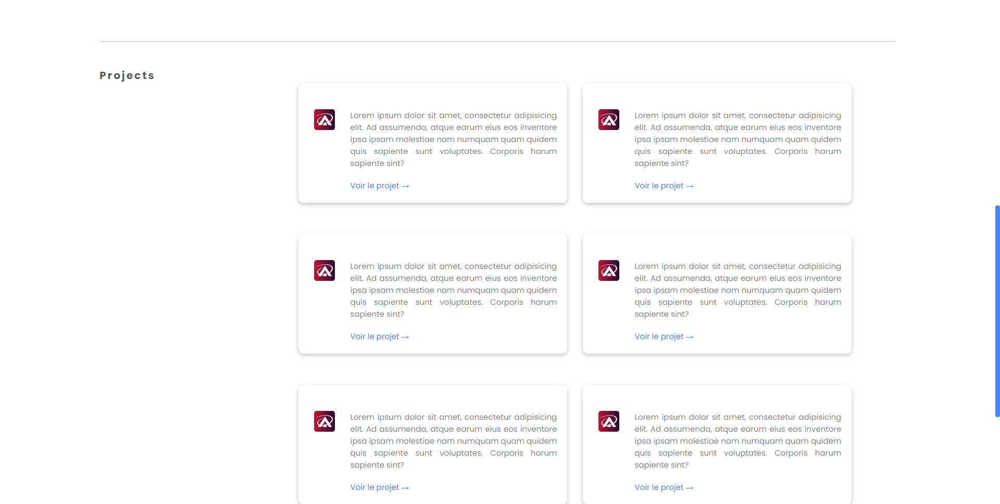
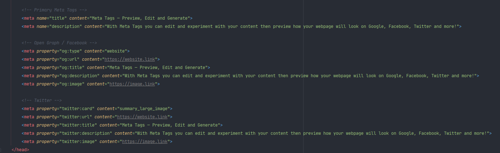
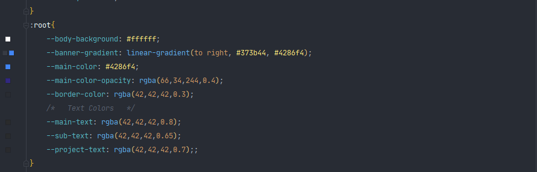
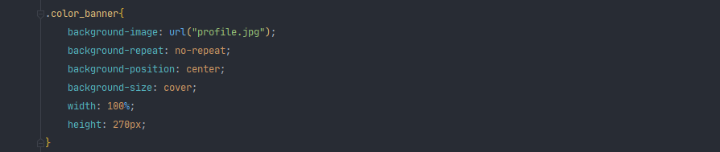
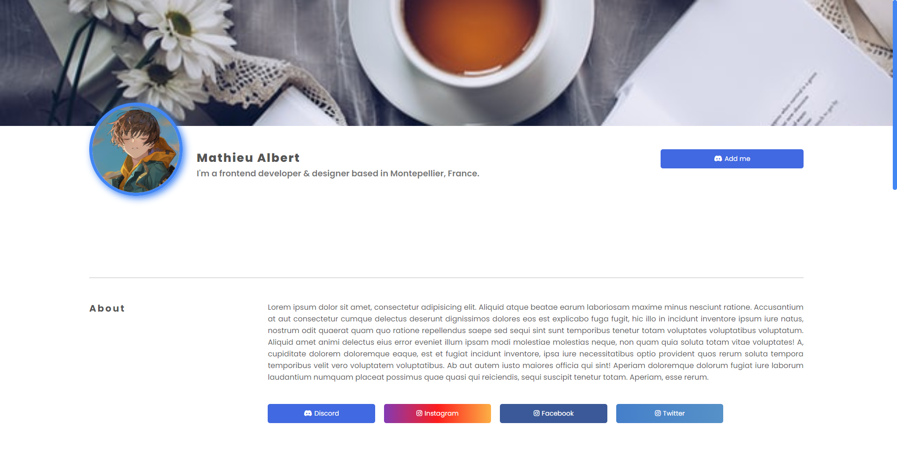

# YourPortfolio
Make yourself known, and show your projects with this portfolio. Add your networks so that others can follow you !

> Demo・https://demo.creative-ressources.fr/YourPortfolio/index.html

## Overview

## Customize 

### SEO & Portfolio description

You just have to change the content of the meta tags with the description of your site, the title that you will see on the tab of your browser. As well as an image / logo / banner that you could embed on the networks.

### Colors & Backgrounds

To change the colors of the site you must go to the file main.css as on the screen you will find at the top of the document a block named root you just have to change the values according to your desires. 

   
### Banner Image

If you want to put an image instead of a gradient you will have to modify the css code as below. 

Result Page :

